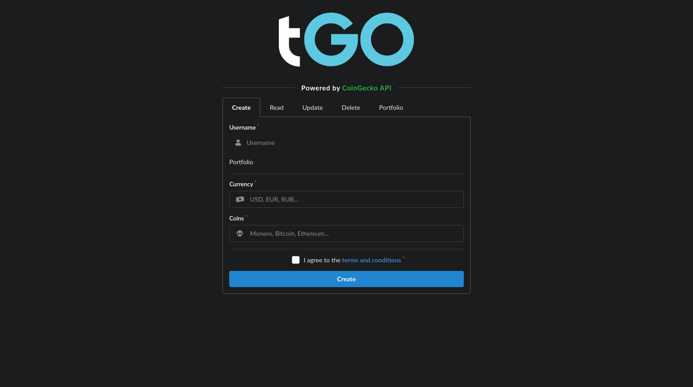

<h1 align="center">

<!-- [](https://github.com/bastean) -->

[](https://github.com/bastean/tgo)

</h1>

<div align="center">

> Example of interoperability between a Web App, a Telegram Bot and a third-party API.

</div>

> [!IMPORTANT]
>
> - `tGO` is still in the early stages of development.

<br />

<div align="center">

[](LICENSE)
[](https://goreportcard.com/report/github.com/bastean/tgo)
[](https://github.com/commitizen/cz-cli)
[](https://github.com/release-it/release-it)

</div>

<div align="center">

[](https://github.com/bastean/tgo/actions/workflows/upgrade.yml)
[](https://github.com/bastean/tgo/actions/workflows/ci.yml)
[](https://github.com/bastean/tgo/actions/workflows/release.yml)

</div>

<div align="center">

[](https://pkg.go.dev/github.com/bastean/tgo)
[](https://github.com/bastean/tgo/releases)

</div>

## Showcase

<div align="center">



</div>

## CLI

### Installation

```bash
go install github.com/bastean/tgo/cmd/tgo@latest
```

### Usage

> [!NOTE]
>
> - We need to create an `.env` file where we have our own values defined.
>   - In the [.env.example.cli](deployments/.env.example.cli) file, we can see the values that can be used.
>     - If we want only certain users to be able to interact with the bot to “test” it, then we must define their respective usernames in the `TGO_BOT_TELEGRAM_WHITELIST_USERNAMES` variable, otherwise anyone will be able to interact with it.
> - Following these step-by-step guides we will get the required values for third-party services like `Telegram` and `CoinGecko`.
>   - ["BotFather, creating and managing bots"](https://core.telegram.org/bots/features#botfather), we will get our authentication token for our `Telegram Bot`.
>   - ["Setting Up Your API Key"](https://docs.coingecko.com/v3.0.1/reference/setting-up-your-api-key), we will get our `CoinGecko` demo key.

```bash
tgo -h
```

```text
_____  ________________
__  /_ __  ____/__  __ \
_  __/ _  / __  _  / / /
/ /_   / /_/ /  / /_/ /
\__/   \____/   \____/

Example of interoperability between a Web App, a Telegram Bot and a third-party API.

Usage: tgo [flags]

  -env string
    	Path to ENV file (required)
```

## Docker

### Usage (Demo)

> [!NOTE]
>
> - We must define our own `Telegram` and `CoinGecko` values in the file [.env.demo](deployments/.env.demo) by modifying the variables `TGO_BOT_TELEGRAM_*` and `TGO_API_COINGECKO_*`.
>   - If we want only certain users to be able to interact with the bot to “test” it, then we must define their respective usernames in the `TGO_BOT_TELEGRAM_WHITELIST_USERNAMES` variable, otherwise anyone will be able to interact with it.
> - Following these step-by-step guides we will get the required values for third-party services like `Telegram` and `CoinGecko`.
>   - ["BotFather, creating and managing bots"](https://core.telegram.org/bots/features#botfather), we will get our authentication token for our `Telegram Bot`.
>   - ["Setting Up Your API Key"](https://docs.coingecko.com/v3.0.1/reference/setting-up-your-api-key), we will get our `CoinGecko` demo key.

```bash
make demo
```

## Workflow

### Idea

The system allows the user to register a “portfolio” of cryptocurrencies to perform different actions on it, such as consulting the market “prices” of the registered coins.

### Functionality

It is a simple monolith where CRUD operations are performed from the Web App and the Telegram Bot to the same database, this allows us to manage users from different applications.

## First Steps

### Clone

#### HTTPS

```bash
git clone https://github.com/bastean/tgo.git && cd tgo
```

#### SSH

```bash
git clone git@github.com:bastean/tgo.git && cd tgo
```

### Initialize

#### Locally

1. System Requirements

   - [Go](https://go.dev/doc/install)
   - [Node](https://nodejs.org/en/download)
   - [Make](https://www.gnu.org/software/make)
   - [Docker](https://docs.docker.com/get-docker)

2. Run

   ```bash
   make init
   ```

### ZIP

1. [System Requirements](#locally)

2. Run

   ```bash
   make genesis
   ```

### Run

#### ENVs

> [!IMPORTANT]
> Before running it, we must initialize the following environment variable files:
>
> - [.env.example](deployments/.env.example)
>   - We will have to create a `.env.(dev|test|prod)` for each runtime environment.
>   - In the [.env.example.demo](deployments/.env.example.demo) file, we can see the values that can be used.
>
> In case we only want to run the **Integration** or **Acceptance** tests, in addition to having the `.env.test` file, we must have the following files created:
>
> - [.env.example.test.integration](deployments/.env.example.test.integration)
>   - Rename the file to `.env.test.integration`.
> - [.env.example.test.acceptance](deployments/.env.example.test.acceptance)
>   - Rename the file to `.env.test.acceptance`.

#### Development

```bash
make compose-dev
```

#### Tests

##### Unit

```bash
make test-unit
```

##### Integration

```bash
make compose-test-integration
```

##### Acceptance

```bash
make compose-test-acceptance
```

##### Unit / Integration / Acceptance

```bash
make compose-tests
```

#### Production

```bash
make compose-prod
```

## Tech Stack

#### Base

- [Go](https://go.dev)
- [Telebot](https://github.com/tucnak/telebot)
- [Echo](https://echo.labstack.com)
- [templ](https://templ.guide)
  - [Fomantic-UI](https://fomantic-ui.com)
- [Cassandra](https://gocql.github.io)
- [CoinGecko API](https://www.coingecko.com/api)

#### Please see

- [go.mod](go.mod)
- [package.json](package.json)

## Contributing

- Contributions and Feedback are always welcome!
  - [Open a new issue](https://github.com/bastean/tgo/issues/new/choose)

## License

- [MIT](LICENSE)
